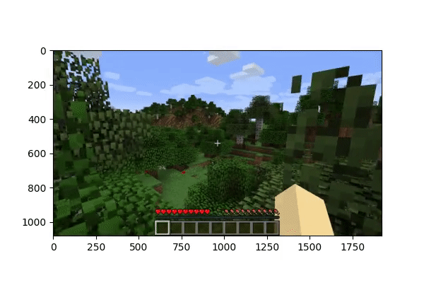
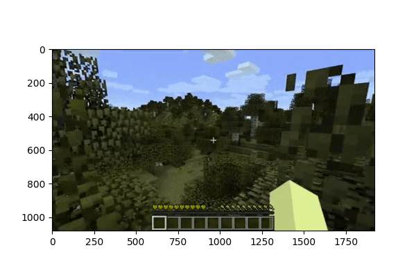

# TensorVision
Project is devoted to video compression problem adopting the 
Tucker(stHOSVD) and Tensor-Train(TTSVD) decompositions

### Example
#### Original image

#### Decoded image

### Installation
One need to install ffmpeg binaries to ./ffmpeg
~~~
conda create -n <env_name> pip
conda activate <env_name>
pip install -r requirements.txt
~~~

Currently, this package works only with yuv420 raw format (.y4m)

One can use it as follows
~~~
import numpy as np

from cvtcomp.base import TensorVideo
from cvtcomp.io import load_video_to_numpy

# Loading the video in RGB24 format from .y4m and its metadata 
video, fourcc, fps, size = load_video_to_numpy(<LOAD_FNAME>)

tensor_video = TensorVideo(
    compression_type='tucker', quality=30.0, chunk_size=20, decoded_data_type=np.uint8
)

tensor_video.encode(video)

# Decoding the video to RGB24 format
restored_video = tensor_video.decode()  
~~~

The more detailed tutorial and EDA are shown in 
~~~
./EDA.ipynb
~~~ 

